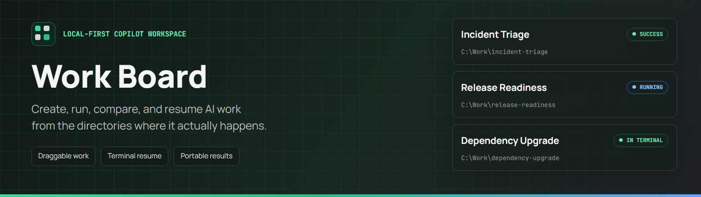
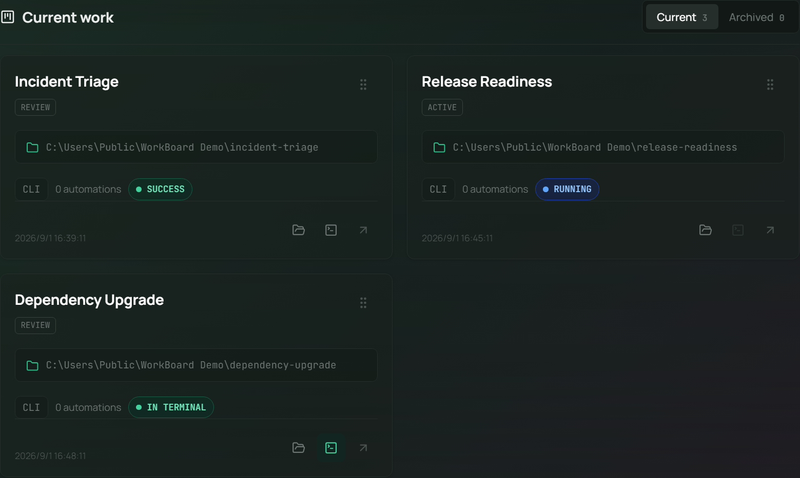
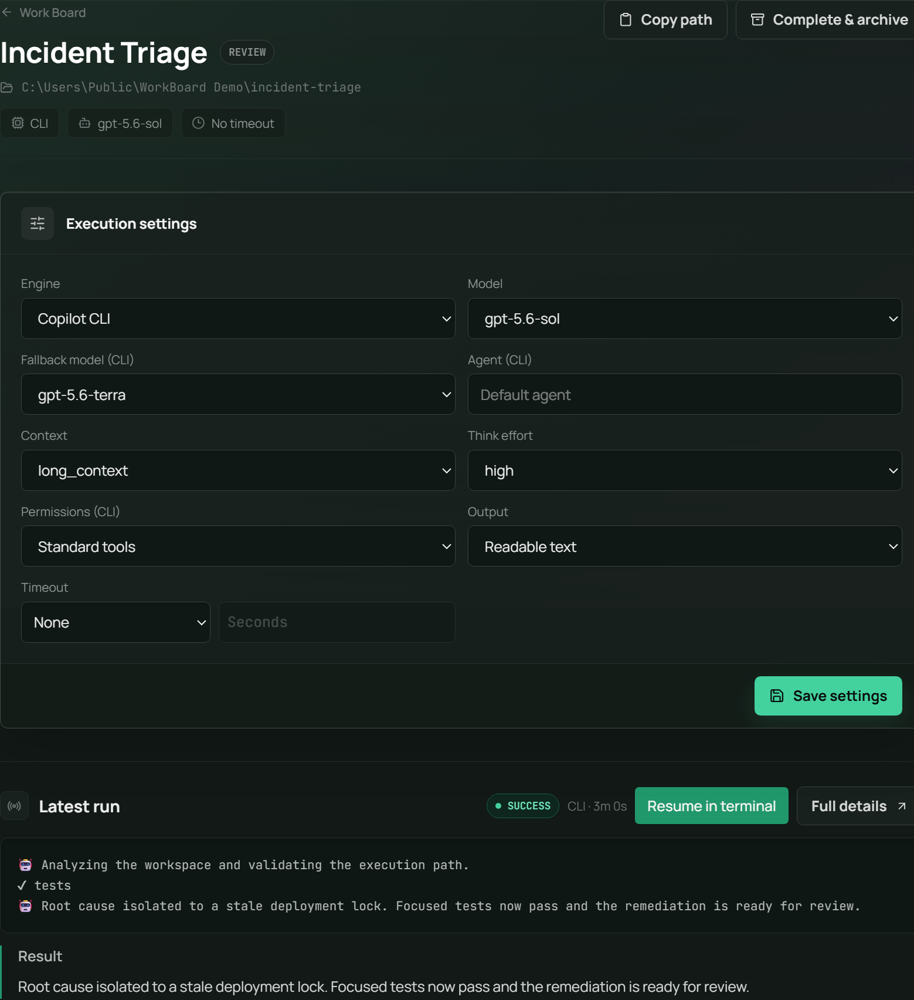

# Work Board

Work Board is a local-first workspace for quickly creating, running, comparing, resuming, and archiving [GitHub Copilot CLI](https://github.com/github/copilot-cli) work. A Work points at a real directory, keeps its prompt beside the resources, and collects portable output for every run.

The existing scheduled task system remains available as **Automations**. The application is still a single Next.js process: UI, API routes, queue, and cron scheduler run together.

Once Work Board is running, open the bilingual [in-app Docs](http://localhost:3100/docs) at `/docs` for the complete feature guide, operational boundaries, and Release Notes.

## Application tour

### Work Board

Current Work is displayed as a responsive card grid. Drag the card handle to persist a custom order, or use the card actions to open the directory, resume the latest eligible session in Windows Terminal, or inspect the Work.



### Work details

Each Work keeps its execution settings, prompt, latest Run, result, artifacts, and Terminal Resume workflow together. The output setting controls whether Copilot CLI emits readable text or raw JSON events, and Work timeout defaults to None.

Work cards show the latest Run's actual model usage and total input + output tokens after the Copilot session shuts down. Hover the token count for input, output, cache, and reasoning details. Work Board checks persisted session events for both readable-text and JSON CLI Runs; exit code 0 is not considered success when tools or sub-agents remain unfinished, are cancelled before a root response, or no root-level final response exists. In that case it resumes the same session up to three times before marking the Run failed.



## Features

- **Fast Work creation** — enter or browse to a directory, create and automatically select a child folder when needed, write a prompt, then create and run in one action. Missing directories are created automatically.
- **First Run in Terminal** — create a Work and open a new interactive Copilot session in Windows Terminal with the saved Prompt and CLI settings. Closing Terminal syncs the session, result, usage, and artifacts back to Work Board.
- **Draggable Work cards** — scan Current Work as a responsive card grid and drag cards into a persistent custom order with pointer, touch, or keyboard controls.
- **Card-level local actions** — open a Work directory in Windows Explorer or resume its latest eligible Copilot session in Windows Terminal directly from the card. Active terminal sessions are identified as **IN TERMINAL**.
- **Common Root directories** — save frequently used roots in New Work, browse their immediate child folders, select a Work directory, or open a root or child folder directly in Windows Explorer.
- **Prompt templates** — fill, append, or replace prompt text with built-in workflows, and manage or import reusable Markdown and plain-text templates in Settings.
- **Portable prompts** — `PROMPT.md` is the source of truth and autosaves with external-edit conflict detection. New Work can read an existing top-level `Prompt` (no extension), `PROMPT.md`, or numbered Prompt file without changing it; multiple Works sharing one directory use `PROMPT-2.md`, `PROMPT-3.md`, and so on.
- **Numbered folder copies** — confirm and copy the selected directory to the next monotonic sibling (`work-2`, `work-3`, and so on), open the copy in Explorer for edits, then return to write the Prompt and run it. Copies include hidden files, `.git`, dependencies, and build output.
- **Resource initialization** — start from the selected local path or copy a registered Resource into a new Work directory.
- **Dual engines** — use the existing Copilot CLI runner or the official `@github/copilot-sdk`. CLI is the default.
- **Explicit Work execution settings** — configure engine, agent, primary and fallback models, context size, reasoning effort, permissions, and readable or raw JSON output per Work. Every Run freezes those settings for later inspection.
- **Execution defaults** — set shared Work and Automation defaults in Settings; new items inherit them while existing saved settings remain unchanged.
- **Optional Work timeout** — Work runs default to no timeout, but each Work can set a 30–86400 second limit. Automation timeouts remain independently configurable.
- **Skill comparisons** — discover project Skills or add a local Skill directory, freeze one resource snapshot, then run complete isolated copies in parallel with explicit `/skill-name` or automatic invocation.
- **Live and resumable runs** — stream output, cancel work, and resume the exact Copilot session in Windows Terminal from a Work card, Work details, or Run details. After the terminal exits, its new session events sync back to Work Board.
- **In-app Follow Up** — send another prompt from Work details after active Runs finish. Work Board resumes the latest session with inherited execution settings, or starts the first session automatically, appends the message to `PROMPT.md`, and links parent/child Runs for navigation.
- **Session compatibility repair** — read legacy Copilot permission events during Sync and safely upgrade them before Resume, with an atomic backup and active-process protection.
- **Portable results** — every Work, Experiment, terminal-resume, and Automation run writes `result.md`, `transcript.jsonl`, `diff.patch`, `run.json`, `stdout.log`, and `stderr.log`.
- **Background system notifications** — receive host OS notifications for successful, failed, or timed-out Work and Automation Runs even when every browser tab is closed. Experiments notify once after all variants settle; configure or test notifications in Settings.
- **Archive without deleting** — completed Work and Automations can be archived and restored while keeping directories, sessions, and history.
- **Automations** — existing manual, cron, signed GitHub webhook, and token-authenticated API triggers remain compatible.
- **Inline Resources** — select, add, edit, or remove an Automation Resource directly in New Automation; there is no separate Resource workspace to manage.
- **Light and dark themes** — follow the operating system on first use, then persist an explicit theme selected from the navigation bar.

## Tech stack

Next.js 16 (App Router, Turbopack) · React 19 · TypeScript · Tailwind CSS v4 · dnd-kit · Prisma 7 + SQLite · GitHub Copilot CLI + Copilot SDK · Vitest · Auth.js with Microsoft Entra ID.

## Work directory layout

```text
my-work/
├── PROMPT.md
├── project resources...
└── .workboard/
   ├── index.json
   ├── works/<work-id>.json
   ├── outputs/<run-id>/
   │   ├── result.md
   │   ├── transcript.jsonl
   │   ├── diff.patch
   │   ├── run.json
   │   ├── stdout.log
   │   └── stderr.log
   └── variants/<work-id>/<experiment-id>/...
```

`.workboard/` is excluded when Work Board copies a Work, preventing recursive copies. It is otherwise ordinary, inspectable local data and should be included when backing up the Work.

## Getting started

### Prerequisites

- Node.js and npm
- The [GitHub Copilot CLI](https://github.com/github/copilot-cli) (`copilot`) installed and authenticated (interactive `/login`, or a `GH_TOKEN`/`GITHUB_TOKEN` env var with the "Copilot Requests" permission)
- `git` on your `PATH`
- Optional: a Microsoft Entra ID (Azure AD) app registration when sign-in is required — see [Authentication setup](#authentication-setup) below

### Run in dev mode

Copy `.env.example` to `.env`. Leave both Microsoft Entra credential values empty for login-free local mode, or fill in both credentials and `AUTH_SECRET` to require sign-in.

```bash
npm install
npm run quickstart   # generates the Prisma client, applies migrations, then starts `next dev`
```

Or step by step:

```bash
npm install
npx prisma generate
npx prisma migrate deploy
npm run dev
```

Open [http://localhost:3100](http://localhost:3100).

### Run a Release (production) build

Dev mode rebuilds on every request and isn't meant for long-running/scheduled use. To run the optimized production build instead:

```bash
npx prisma migrate deploy  # only needed if there are new migrations
npm run build              # prebuild generates Prisma Client automatically
npm run start              # runs `next start -p 3100` — serves the build, no hot-reload
```

The `node-cron` scheduler starts automatically in both dev and production mode, as long as the process keeps running — see [Scheduling notes](#scheduling-notes) below.

### Run the Release in the background

The same commands work in PowerShell/Command Prompt on Windows and Terminal on macOS. The start command generates Prisma, applies migrations, builds the release, then launches Work Board detached from the terminal with output redirected to `data/`:

```bash
npm run background:start
```

The terminal can be closed after the command reports that Work Board started. Manage the detached process with:

```bash
npm run background:status
npm run background:logs
npm run background:restart
npm run background:stop
```

Use `npm run background:restart` after pulling code, changing dependencies, or adding migrations; it stops Work Board, generates Prisma, applies migrations, rebuilds, and starts the new release. Use `npm run background:restart:fast` to restart the existing build without rebuilding it. `background:start:fast` remains available when Work Board is stopped and the release is already built.

System notifications are emitted by this background process, not by the browser. They appear on the machine running Work Board and require an interactive desktop session plus OS notification permission. Delivery is at-most-once: a claimed notification is never repeated after restart.

## Authentication setup

Work Board chooses its authentication mode from the two Microsoft Entra environment variables:

- **Login-free local mode:** leave both `AUTH_MICROSOFT_ENTRA_ID_ID` and `AUTH_MICROSOFT_ENTRA_ID_SECRET` empty. All Next.js entrypoints bind to `127.0.0.1`, requests must use a loopback host, and data is owned by a persistent `workboard-local-user` database record. `AUTH_SECRET` is not required.
- **Microsoft Entra mode:** set both variables and `AUTH_SECRET`. The existing Microsoft sign-in and per-user ownership behavior remains enabled. Setting only one Entra variable is rejected at startup.

Local and Entra users have different owner IDs, so switching modes does not merge or expose one mode's Works, Automations, tokens, or settings in the other mode.

To configure Microsoft Entra mode:

1. **Create the app registration** (supports both work/school and personal Microsoft accounts):
   ```bash
   az ad app create --display-name "Work Board" \
     --sign-in-audience AzureADandPersonalMicrosoftAccount \
     --web-redirect-uris "http://localhost:3100/api/auth/callback/microsoft-entra-id" \
     --enable-id-token-issuance true
   ```
2. **Create a client secret** for the app you just created (use its `appId` from the previous step's output):
   ```bash
   az ad app credential reset --id <appId> --display-name "workboard-nextauth" --years 2
   ```
3. **Create a service principal** so consent/sign-in works:
   ```bash
   az ad sp create --id <appId>
   ```
4. **Add the env vars** to `.env` (see the table below) using the `appId` and secret from steps 1–2, plus a freshly generated `AUTH_SECRET`:
   ```bash
   node -e "console.log(require('crypto').randomBytes(32).toString('base64'))"
   ```
5. For a non-localhost deployment, add its callback URL (`https://<your-domain>/api/auth/callback/microsoft-entra-id`) as an additional `--web-redirect-uris` entry on the app registration, and set `AUTH_URL` to that domain.

No `AUTH_MICROSOFT_ENTRA_ID_ISSUER` is set intentionally — omitting it makes Auth.js default to the `common` endpoint, which is required for personal Microsoft accounts (not just organizational ones) to be able to sign in.

## Scheduling notes

Scheduled tasks are driven entirely by the Node.js server process (`instrumentation.ts` → `node-cron`), not by the browser — a task will still fire on schedule even if no browser tab is open. What _does_ matter is keeping the server process itself alive continuously:

- Don't let the machine sleep/hibernate while relying on schedules (suspends all timers). While the server is running, Work Board automatically prevents idle system sleep on Windows (via `SetThreadExecutionState`) and macOS (via `caffeinate`); the display may still turn off normally. Set `CODEBOARD_PREVENT_SLEEP=false` to disable this. On Linux, configure sleep inhibition at the OS/service level.
- Run the server as a persistent background process (e.g. `pm2`, a Windows service via NSSM, or a Task Scheduler/systemd entry set to restart on failure) rather than a terminal you might close.
- There's currently no "catch up on missed runs" — if the process was down when a scheduled time passed, that run is simply skipped.

## Configuration

| Env var                           | Purpose                                                                                       |
| --------------------------------- | --------------------------------------------------------------------------------------------- |
| `DATABASE_URL`                    | SQLite connection string, defaults to `file:./dev.db` (see `.env`)                            |
| `GH_TOKEN` / `GITHUB_TOKEN`       | Optional PAT for headless Copilot CLI auth (needs "Copilot Requests" permission)              |
| `AUTH_MICROSOFT_ENTRA_ID_ID`      | Optional client ID; leave this and the client secret empty for loopback-only local mode       |
| `AUTH_MICROSOFT_ENTRA_ID_SECRET`  | Optional client secret; must be set together with the client ID                               |
| `AUTH_SECRET`                     | Random Auth.js session secret; required when Microsoft Entra mode is enabled                  |
| `AUTH_URL`                        | Base URL of the deployment (e.g. `http://localhost:3100`), used to build OAuth callback URLs  |
| `AUTH_TRUST_HOST`                 | Set to `true` when running behind a reverse proxy or on a non-standard host/port              |
| `CODEBOARD_PREVENT_SLEEP`         | Set to `false` to disable automatic Windows/macOS idle-sleep prevention                       |
| `WORKBOARD_ENABLE_LOCAL_TERMINAL` | Allow a trusted non-localhost request to open Windows Terminal on the server; default `false` |
| `WORKBOARD_LOCAL_URL`             | Loopback URL used by the terminal exit callback; default `http://127.0.0.1:3100`              |

Local state — the SQLite database, compatibility logs, terminal launch credentials, and auto-cloned Resources — lives under `dev.db` and `data/`. Work prompts, experiment copies, and standard results live in each Work directory.

## Operational boundaries

- Work Board is designed for one trusted machine and one Next.js server instance. Queue state is recovered after restart, but there is no distributed lock for multiple application replicas.
- Running two agents directly in the same directory is allowed and clearly marked unsafe: file changes and diffs may be mixed. Use the numbered-copy option or Skill variants when result attribution matters.
- Full copies can be large because they intentionally include dependencies, build output, hidden files, and Git metadata. Check available disk space before large comparisons.
- Windows Terminal resume is only offered for sessions created on the same host. Remote deployments should leave local terminal launch disabled.
- Work processes receive an environment allowlist. Auth.js, Entra, and database secrets are not forwarded to Copilot.
